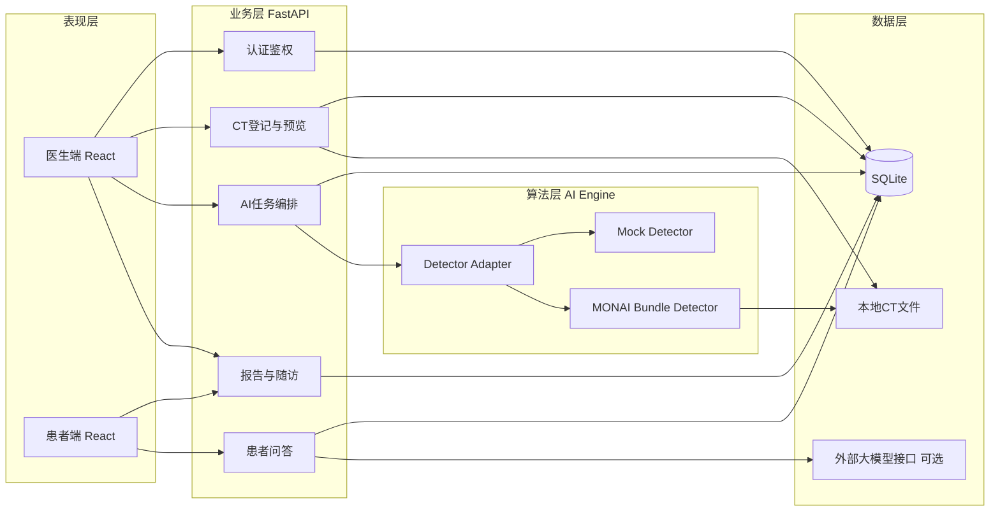

# 基于肺部 CT 的肺结节智能辅助检出与医患协同随访系统设计文档

## 1. 项目概述

项目名称：DeepLung 肺结节智能辅助检出与医患协同随访系统。

本项目面向《医学人工智能》课程大作业，设计一个面向肺部 CT 场景的课程原型。系统以肺结节辅助检出为核心，向上连接医生端分诊与报告签发，向下连接患者端报告查看、问答解释和随访提醒，形成“影像上传 - AI 分析 - 医生审核 - 患者理解 - 后续随访”的完整闭环。

本系统仅用于教学展示与原型验证，不直接用于临床诊断。系统输出的结节候选框、风险分层和问答结果仅作为辅助信息，最终结论必须以医生判断为准。

## 2. 选题背景与需求分析

肺结节是肺癌早筛中的重要影像学线索，胸部 CT 在筛查中广泛应用，但单次检查往往包含大量切片，人工阅片耗时较长，医生容易面临高工作负荷和分诊压力。另一方面，患者收到报告后常常难以理解医学术语，也容易忽略复查安排。因此，本项目的目标不是只做一个检测模型，而是把检测、解释和随访整合成一个更接近真实医疗流程的软件产品。

系统主要服务三类角色：

1. 医生：上传 CT、查看 AI 结果、编辑并签发报告、向患者发送消息。
2. 患者：查看已发布报告、理解风险等级、接收随访提醒、进行智能问答。
3. 管理员：维护演示账号和系统运行环境。

根据课程要求和项目实际实现，系统需要满足以下需求：

1. 支持医生和患者两类主要角色登录并进入对应页面。
2. 支持创建 CT 检查记录并触发 AI 推理任务。
3. 支持返回结节位置、直径、检测分数和系统级风险分层结果。
4. 支持医生基于 AI 结果编辑并发布正式报告。
5. 支持患者查看风险灯、摘要、建议、结节信息和随访日期。
6. 支持医患消息与报告问答，提高患者理解能力。
7. 支持真实模型和 mock 模式双通路，保证课堂演示稳定。

## 3. 相关研究与技术依据

肺结节检测是医学影像 AI 中较成熟的研究方向，LIDC-IDRI 与 LUNA16 等公开数据集为该任务提供了数据基础[1][2]。本项目采用 MONAI 官方 lung nodule CT detection bundle 作为真实检测能力的参考实现，它能够输出 3D CT 中的结节候选框与检测分数[3]。在课程原型中，我们增加了统一输入输出格式、推理服务化和结果结构化处理，使其可以接入完整业务系统。

技术选型方面，前端使用 React 构建页面；后端使用 FastAPI 提供认证、任务管理和报告接口；数据库层使用 SQLAlchemy 管理结构化数据；AI 服务独立运行，支持 mock 检测器与 MONAI 检测器切换；患者问答模块既支持本地规则回复，也支持外部大模型兼容接口。该方案兼顾展示效果、工程复杂度和可扩展性。

## 4. 总体设计

### 4.1 设计目标

本系统的总体目标有四点：

1. 实现“检测 - 报告 - 随访”的完整业务链路。
2. 让 AI 检测结果可以被医生使用、被患者理解。
3. 支持真实模型与 mock 模式切换，保证系统稳定可演示。
4. 体现医学 AI 产品在工程落地中的角色分工、接口设计和风险边界。

### 4.2 系统架构

系统采用前后端分离与 AI 服务独立部署的架构，分为四层：

1. 表现层：React 前端，包括医生端登录、工作台、报告中心，以及患者端报告与问答页面。
2. 业务层：FastAPI 后端，负责认证、CT 登记、AI 任务编排、报告发布、消息管理等逻辑。
3. 算法层：AI Engine，封装 mock 检测器和 MONAI bundle 检测器。
4. 数据层：SQLite 持久化业务数据，本地文件路径用于读取 CT 影像。

系统架构图如下：

### 4.3 设计原则

1. 分层解耦：前端、后端、AI 引擎相互独立。
2. 输出统一：不同检测模型统一返回相同字段。
3. 失败可回退：真实模型不可用时可自动退回 mock。
4. 医生主导：AI 仅为辅助，不替代医生签发结论。
5. 谨慎表达：风险分层不等同于恶性概率。

## 5. 关键业务流程设计

医生端主流程为：医生登录后创建检查记录，输入患者 ID 和 CT 路径，后端生成 `study_id` 并创建 AI 任务；AI Engine 完成推理后返回结节信息和风险等级；后端更新任务结果和分诊列表；医生在工作台查看 AI 结果并签发正式报告。

患者端主流程为：患者登录后查看已发布报告，系统用红、黄、绿风险灯配合摘要文本展示结果；患者可以查看医生发送的消息和复查日期；若对报告存在疑问，可通过智能助手获得通俗化解释。问答模块会优先读取当前报告摘要与建议，并限制回答范围。

## 6. 模块设计

### 6.1 前端模块

医生端包含登录页、风险分诊看板、报告中心和工作台。看板用于按风险高低排序患者；工作台用于触发 CT 分析、查看结节结果、签发报告，并发送医患消息。患者端整合了报告展示、随访信息、医生消息和问答助手。

### 6.2 后端模块

后端主要包括：

1. `auth`：登录鉴权和 JWT 签发。
2. `upload/studies`：创建检查记录与 CT 预览。
3. `ai`：创建任务、轮询状态、调用 AI Engine。
4. `doctor`：患者分诊、报告中心、报告签发、消息发送。
5. `patient`：患者报告查询、消息查看。
6. `chat`：基于报告上下文的问答接口。

课程原型中，AI 任务通过 FastAPI 后台任务异步执行，这种实现轻量且适合课堂环境。

### 6.3 AI 引擎模块

AI 引擎采用适配器模式。`MockDetector` 用于联调和兜底，保证系统可演示；`MonaiBundleDetector` 调用真实 CT 检测模型，输出结节坐标、直径、体积、检测分数、风险分值、风险等级和摘要文本。后端只依赖统一结果结构，从而实现模型可替换。

### 6.4 数据库设计

数据库核心表包括：

1. `users`：账号、密码哈希、角色。
2. `studies`：检查单、患者 ID、CT 路径、状态。
3. `jobs`：AI 任务状态、风险分数、结节结果。
4. `patient_triage`：医生看板所需的最新风险排序信息。
5. `reports`：正式报告、建议、结节信息和随访时间。
6. `doctor_patient_messages`：医生发给患者的消息记录。

这些数据表覆盖了课程项目中的主要业务闭环。

## 7. 接口与 UI 设计

系统采用统一的 REST 风格接口，核心接口包括：`/auth/login`、`/upload_ct`、`/ai/predict/{study_id}`、`/ai/jobs/{job_id}`、`/doctor/patients`、`/doctor/studies/{study_id}/publish_report`、`/patient/report/{report_id}` 和 `/chat/assistant`。AI Engine 侧核心接口为 `POST /v1/predict`，输入检查标识和 CT 路径，输出结构化检测结果。这种接口分层使业务服务与模型服务解耦。

UI 设计上，医生端强调表格、任务状态和风险排序；患者端强调摘要卡片、风险信号灯、倒计时和自然语言问答。该差异化设计符合两类用户的需求。

## 8. 可行性、性能与安全性分析

从技术可行性看，React、FastAPI、MONAI 和大模型兼容接口都较为成熟，足以支撑课程原型开发。从工程可行性看，系统支持 mock 与真实模型双模式，即使没有 GPU 也可以用 CPU 或 mock 模式完成演示。从算法可行性看，肺结节检测有公开数据集和已有模型基础，不需要在课程项目中重新训练全部模型。

性能方面，系统通过 AI 服务独立部署、异步任务执行、统一结果持久化和 CPU/GPU 自适应等方式降低阻塞风险。影像展示采用轻量化预览图和标记点，而不是复杂三维渲染，从而减少实现成本。若后续升级到生产环境，可进一步引入 Redis 队列、对象存储和任务重试机制。

安全与合规方面，系统实现了 JWT 登录、密码哈希、患者标识脱敏、角色分离和“非临床系统”声明。患者问答模块只提供解释与建议，不输出确诊结论，体现了医学场景下的谨慎原则。

## 9. 创新点与不足

本项目的创新点主要有三点：第一，将肺结节检测从单点算法扩展为“检测 - 报告 - 随访”闭环产品；第二，在患者端引入大模型辅助解释，提高报告可理解性；第三，通过检测器适配层实现模型可插拔。

不足之处也需要明确说明：当前系统未接入真实医院 HIS/PACS；风险等级是课程原型中的辅助分层，不代表临床恶性概率；前端影像展示仍以二维预览为主；系统尚未经过正式临床验证。因此，本项目更适合作为教学原型和设计方案展示。

## 10. 小组分工建议

若为 3 人小组，可按如下方式分工：

1. 成员 A：需求分析、PPT 制作、前端界面与答辩展示。
2. 成员 B：后端接口、数据库设计、业务流程联调。
3. 成员 C：AI 引擎接入、模型调试、技术文档与实验说明。

若为 2 人小组，可将 A 和 B 合并为系统开发负责人，C 负责 AI 与文档；若为 1 人完成，可在最终提交版中说明由同一成员独立完成全部工作。

## 11. 结论

DeepLung 项目完成了一个符合课程要求的 AI 医疗软件原型设计。系统以肺结节 CT 智能辅助检测为核心，以医生端风险分诊和报告签发为主线，以患者端报告解释与随访问答为延伸，形成了较完整的产品方案。该项目不仅展示了医学影像 AI 的应用，也体现了软件工程、接口设计、用户角色划分和医疗场景边界控制等综合能力，适合作为《医学人工智能》课程大作业答辩项目。

## 参考文献

[1] Armato SG 3rd, McLennan G, Bidaut L, et al. The Lung Image Database Consortium and Image Database Resource Initiative: A completed reference database of lung nodules on CT scans. Medical Physics, 2011.

[2] LUNA16 Grand Challenge. LUng Nodule Analysis 2016. https://luna16.grand-challenge.org/

[3] MONAI Consortium. lung_nodule_ct_detection bundle README. 项目本地路径：`ai-engine/models/lung_nodule_ct_detection/docs/README.md`

[4] Lin T Y, Goyal P, Girshick R, et al. Focal Loss for Dense Object Detection. ICCV, 2017.

[5] FastAPI Official Documentation. https://fastapi.tiangolo.com/

[6] React Official Documentation. https://react.dev/
